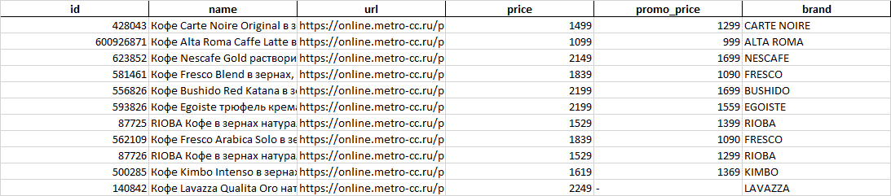

# Metro parser

## Описание проекта
Данный проект представляет собой инструмент для извлечения данных о продуктах из интернет-магазина Metro и экспорта этих данных в формат Excel.

## Установка и настройка
1. Клонирование репозитория:
```
# склонируйте репозиторий на свой компьютер
git clone https://github.com/greengoblinalex/metro_parser
```

2. Установка зависимостей:
```
# установите необходимые зависимости
pip install -r requirements.txt
```

3. Настройка параметров:<br>
Для настройки параметров запроса к API Metro используются следующие аргументы метода `fetch_products_data()` класса `MetroParser`:
* slug (int): Slug категории продуктов. По умолчанию - категория кофе.
* store_id (int): ID магазина Metro. По умолчанию - магазин в Москве.
* size (int): Количество продуктов, запрашиваемых за один запрос. По умолчанию - 100.
* from_ (int): Индекс начала списка продуктов. По умолчанию - 0.
* in_stock (bool): Флаг, указывающий на необходимость отображения только продуктов, находящихся в наличии. Если True, отображаются только продукты в наличии, если `False` - все продукты. По умолчанию - `True`.

## Использование
1. Запуск скрипта:
```
# запустите скрипт main.py
python -m src.main
```

2. Получение данных:<br>
Скрипт получит данные о продуктах из магазина Metro для указанных магазинов (Москва, Санкт-Петербург и т. д.), используя класс `MetroParser`, и сохранит их в файл Excel.

3. Экспорт в Excel:<br>
Данные о продуктах будут экспортированы в файл Excel по указанному пути.

<center>



</center>